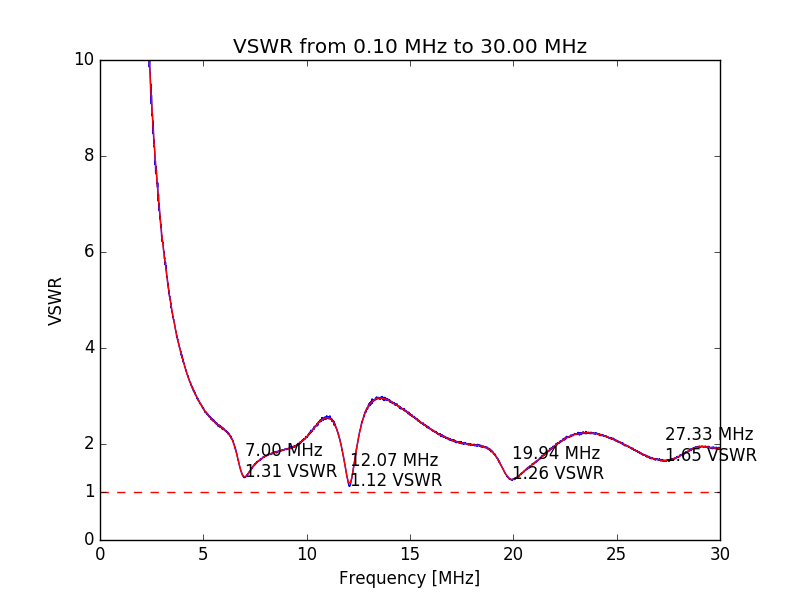

# rigexpert-tool [](https://github.com/vsergeev/rigexpert-tool) [](https://github.com/vsergeev/rigexpert-tool/blob/master/LICENSE)

This is a simple set of Python tools to dump impedance sweeps from a
[RigExpert](http://www.rigexpert.com/) antenna analyzer, plot sweeps, and
convert sweeps from impedance to VSWR. The sweeps are stored in CSV.

## `rigexpert-dump.py`

Requires `pyserial`.

```
$ python3 rigexpert-dump.py
Dump a RigExpert antenna analyzer impedance sweep in CSV to stdout.

Usage: rigexpert-dump.py <serial port> <center frequency> <sweep range> <number of points>

Example: Sweep 0.0 - 30.0 MHz with 5000 points
    python3 rigexpert-dump.py /dev/ttyUSB0 15e6 30e6 5000 > sweep.csv

Example: Sweep 7.000 - 7.300 MHz with 300 points
    python3 rigexpert-dump.py /dev/ttyUSB0 7.150e6 0.300e6 300 > sweep.csv

CSV Format:
    <freq in MHz>,<resistance in ohms>,<reactance in ohms>
    e.g. 15.040000,50.56,0.08 is F=15.04 MHz,R=50.56 ohms,X=0.08 ohms
$
```

```
$ python3 rigexpert-dump.py /dev/ttyUSB0 15e6 30e6 3000 > sweep.csv
Analyzer version: AA-30 103
[===============================---------------------------------------------] 41% 1243/3000
...
$ cat sweep.csv
0.000000,0.00,12.63
0.010003,1.72,79.52
0.020006,6.99,161.06
0.030010,11.54,245.41
0.040014,1.84,340.68
0.050017,18.55,441.84
0.060020,21.01,588.01
0.070024,51.35,703.44
...
$
```

## `rigexpert-csv-plot.py`

Requires `matplotlib`, `scipy`.

```
$ python3 rigexpert-csv-plot.py
Plot an impedance or VSWR sweep CSV.

Usage: rigexpert-csv-plot.py <CSV>
$
```

```
$ python3 rigexpert-csv-plot.py sweep.csv
```



## `rigexpert-csv-imp2swr.py`

```
$ python3 rigexpert-csv-imp2swr.py
Convert sweep CSV from impedance to VSWR.

Usage: rigexpert-csv-imp2swr.py [--smooth] <impedance sweep CSV>

Example:
    python3 rigexpert-csv-imp2swr.py sweep.imp.csv > sweep.swr.csv

Example (smoothed version):
    python3 rigexpert-csv-imp2swr.py --smooth sweep.imp.csv > sweep.smooth.swr.csv

Impedance CSV format:
    <freq in MHz>,<resistance in ohms>,<reactance in ohms>
    e.g. 15.040000,50.56,0.08 is F=15.04 MHz,R=50.56 ohms,X=0.08 ohms

VSWR CSV format:
     <freq in MHz>,<voltage swr>
    e.g. 15.040000,1.01131434816733 is F=15.04 MHz,VSWR=1.01131434816733
$
```

```
$ python3 rigexpert-csv-imp2swr.py sweep.imp.csv > sweep.swr.csv
$ cat sweep.swr.csv
6.950000,1.947882757140012
6.950800,1.9271584205118706
6.951600,1.9374925755747212
6.952400,1.9312406172221719
6.953200,1.9156003387070446
6.954000,1.9206934559673046
...
$
```

